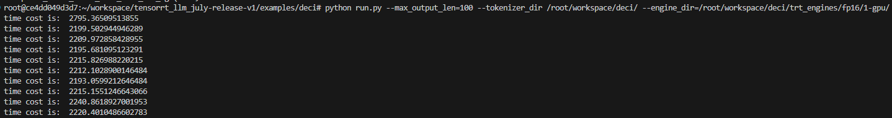
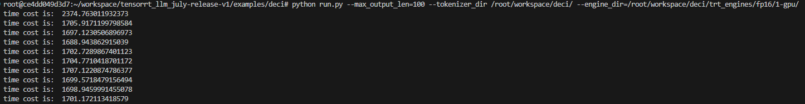

### 总述

本工作为 [NVIDIA TensorRT Hackathon 2023](https://github.com/NVIDIA/trt-samples-for-hackathon-cn/tree/master/Hackathon2023) 的复赛题目，即自选大型语言模型，并使用 TensorRT 或 TensorRT-LLM 进行模型推理优化，我们队伍采用TensorRT-LLM完成对新模型[DeciCoder](https://huggingface.co/Deci/DeciCoder-1b)的构建以及推理优化。

[DeciCoder](https://huggingface.co/Deci/DeciCoder-1b)由深度学习公司Deci推出，可以用各种编程语言生成代码。该模型Decoder layer采用 Grouped Query Attention，其Position Embeddings采用Rotary Position Embeddings， 拥有 1.1B个参数和包含 2048 个标记的大型上下文窗口，能够生成高质量且多样化的代码片段。其huggingface地址为：[https://huggingface.co/Deci/DeciCoder-1b](https://huggingface.co/Deci/DeciCoder-1b)。

模型搭建完的效果：

代码运行步骤见[tensorrt_llm_july-release-v1/examples/deci/README.md](/tensorrt_llm_july-release-v1/examples/deci/README.md).

### 主要开发工作

#### 开发工作的难点

+ **DeciCoder**模型中采用的注意力机制为Grouped Query Attention（GQA）,位置编码的方法采用的是Rotary Position Embedding。复赛使用的TensorRT-LLM的版本尚未实现单GPU下的QGA算法，需要参考DeciCoder模型中GQA的实现，用TensorRT-LLM提供的function去进行搭建。

+ 工程实现中由于TensorRT-LLM构建的为静态图，原本模型中一些分支计算均无法在单个模型中实现，因此我们需要根据这一特性重写原模型中QGA部分的计算逻辑，并且为了适应重写的逻辑，将原本的Rotary Position Embedding算法，以及attention mask的初始化方法也在generation.py中进行了重写。

### 开发与优化过程

**DeciCoder**模型的构建流程：

- 阅读TensorRT-LLM下example的代码，理解TensorRT-LLM的运作流程。
- 根据huggingface中提供的modeling_decicoder.py将**DeciCoder**模型的构建流程理清，尤其是Grouped Query Attention（GQA）的实现。
- 使用TensorRT-LLM的functional.py中的function进行模型的构建
  + 对GQA中所用到的一些计算的方法，例如：Rotary Position Embedding、Repeat KV、Dot Product Attention等进行单元测试；
  + 对整个GQA进行单元测试，并且与torch版本的输出进行比对；
  + 对TRT_LLM中可以直接使用的模块，例如ColumnLinear、GateMLP、RmsNorm等进行单元测试，同样也是和torch版本的输出进行比对；
  + 完成从function到layer的单元测试之后，进行整个模型的搭建
- 编写bulid.py构建engine。
- 编写generation.py和run.py得到运行结果。

**DeciCoder**模型的特别步骤：

上述构建流程只是描述了一个“顺利”的构建流程，由于最开始不太清楚TensorRT-LLM构建的engine为一个静态图，最开始我们对模型进行搭建和测试的时候完全模仿torch版本的模型，包括原始模型中的if分支部分，导致我们在测试的时候虽然通过手动调整输入来满足不同的判断条件，以此测试不同的计算分支并且都能测试通过，但是却在完成模型构建之后模型无法运行。在在了解到engine构建完成之后是静态图之后，我们重新对模型进行了逻辑的梳理，最终完成了模型的搭建。下面将分模块进行详细说明：

+ 1.原始模型中存在的分支计算:大型预训练语言模型的生成机制通常是基于已有的序列一次生成一个新的词或标记，为了节省计算量引入了kv cache的操作，即保存上一次模型根据输入生成的past key和past value。我们选取的模型会根据是否存在past key value的输入进行不同的运算。而构建好的engine作为静态图，无法在运行期对输入的值进行判断并进行不同的运算，因此需要对原模型的计算逻辑进行修改，保证无论past key value是否是有效输入都不影响engine的使用；

+ 2.Rotary Position Embedding算法：这部分和原模型的主要区别是在于原始模型是先根据kv length的总长提取位置编码信息，然后在对query和key添加位置信息的时候，根据position ids的值对位置编码进行切片。我则是在获取位置编码信息的时候就根据past kv length和total kv length进行切片，直接提取需要添加到query和key上的位置信息片段，避免二次切片；

+ 3.Repeat KV和Dot Product Attention：在计算query、key和value之间的关联度的时候，需要三者的注意力头数的维度相同，而在GQA中，key和value的注意力头数是不等于query的，因此需要对query或者key和value进行reshape的操作，保证后续的计算能够正常进行。原始的模型会根据是否有past key value的输入来选择对key和value或是对query进行shape操作，这显然是不满足我们对静态图的需求的。因此在梳理清楚dot product attention计算方法的原理后，我们将这部分的逻辑修改为了无论是否存在有效的past key value输入，均对key和value进行repeat的操作，将key和value的注意力头数扩展到和query的注意力头数相同，既能保证计算有效又能保证结果正确；

+ 4.Attention mask：原始模型中引入了causal attention mask的机制，同样也是根据是否存在有效的past key value输入来判断是否使用，这部分的计算在模型中不好实现通用，因此通过修改generation.py中的_prepare_attention_mask()和_prepare_generation_inputs()两个函数以满足我们计算的需求。

### 优化效果

+ 精度：由于**DeciCoder**模型用于生成代码，其summarize.py评判的机制不太符合生成代码的要求，因此精度的测试我们采用TensorRT-LLM构建模型结果与huggingface模型结果进行对比

如下图：

+ 性能分析：

在本次比赛中，最终搭建的模型在性能表现上与原本模型还是有一定差距。但针对自身搭建模型，我们做了两方面的优化：一方面是将模型从fp32精度转换为fp16精度，另一方面则是对计算图进行了一些简单的优化。对计算图的优化主要是将一些常量在模型初始化阶段进行计算，对一些重复的shape计算进行了合并。下面主要说一下转精度为fp16的过程。
虽然我们使用的模型本身就是在fp16的精度下搭建的，但是当我们尝试以fp16精度构建engine的时候，出现了“No implementation of layer {……} for requested layer computation precision and output precision”。经过排查发现报错的这个layer里面包含了一些我们在model中定义的最后一层layer的节点和不在这一层中的节点，判断可能是TRT内部的操作把这些节点尝试融合成一个layer然后出现了错误。被合并的第一个节点是一个对past key和past value进行concat的节点，我们将该节点的结果用identity节点进行一次计算之后这个问题得到了解决，成功构建了精度为fp16的engine。

最开始搭建的模型性能(max_output_len=100)：

优化后模型的性能(max_output_len=100)：

### Bug报告（可选）

### 送分题答案（可选）

送分题1：

送分题2：

### 经验与体会（可选）

Todo：
本次比赛由于前期构建engine花费时间过多，留给优化模型的时间就很少了，目前看来对qkv计算的操作如果能够合并到一个linear算子的话还能够进一步缩短推理时间。另一方面在通过nsys观察run.py运行的timeline的时候发现，存在很大一部分非CUDA Kernel的运行时间，检查generation.py代码分析可能这部分时间是用于prepare shape和buffer等操作，感觉这部分的操作还有优化空间。
在导出fp16并做精度对其的过程中也发现了所有的rms norm的计算都会出现精度不对齐的warnning，查看function中rms_norm发现这个算子是在float32精度下进行计算的，产生warnning的原因应该就在这里。

四十多天的比赛即将告一段落，感谢Nvidia导师和工作人员提供的帮助和支持,我们队伍从初赛的刚刚入门TRT，到复赛运用TRT-LLM搭建完模型，我们在这中间学习并获得了许多知识和经验，也让我们直观的感受到了TRT在模型推理加速的效果，复赛阶段的大模型构建，也让我们对Transformer、大模型有了深刻的了解。尽管这次模型搭建完的性能上并不是很令人满意，但是在比赛中获得了技术的进步，学习到了新的知识，也是让我们感到开心的事情，期待之后能将TRT、TRTLLM运用的更加熟练透彻。